# stripconf - TUI Config for strip



    

TUI configuration tool for the [strip](https://github.com/isene/tile) status bar
(part of the [tile](https://github.com/isene/tile) WM project), built on
[crust](https://github.com/isene/crust). Reorder, toggle and edit your
asmite-driven status segments without ever opening `~/.striprc` in a text editor.

<br clear="left"/>

## Features

- **Bar globals**: `height`, `top_offset`, `bg`, `fg`, `gap` (and the
  advanced `font` / `char_width` / `baseline` overrides)
- **Segment editor** for the ordered list of bar entries:
  - Reorder with **Shift-J / Shift-K** (left-of-bar = top-of-list)
  - Toggle on/off with **t** (disabled segments persist as `# segment …`)
  - **a**dd a new segment / **d**elete the selected one
  - Edit name, extra-gap (`+N`), per-segment color, command and refresh
    interval via guided prompts
- Live colour swatches for `bg`, `fg` and per-segment colours
- Reads & writes `~/.striprc` directly — preserves your inline comments
  and groups them with the segment they precede
- **Atomic save**: writes `~/.striprc.tmp`, renames the previous file
  to `~/.striprc.bak`, then promotes the new file into place. Even a
  hard kill mid-save can never leave you with an empty config
- After save, optionally restarts strip in-place (`pkill -x strip` +
  `setsid strip`, so the new bar survives stripconf exit)

## Controls

| Key | Action |
|-----|--------|
| j / k          | Move within the current category |
| Tab / S-Tab    | Switch between *Bar globals* and *Segments* |
| h / l          | Adjust numeric global (height, gap, …) |
| Enter          | Edit the current value (free-text input) |
| Shift-J / K    | Reorder selected segment down / up |
| t              | Toggle selected segment on/off |
| a              | Add a new segment |
| d              | Delete the selected segment (asks first) |
| W / s          | Save to `~/.striprc` (asks if you want to restart strip) |
| q / ESC        | Quit (prompts to save when modified) |

## Build

```bash
cargo build --release
```

The binary lands at `target/release/stripconf`. Symlink or copy it
into your `PATH`:

```bash
ln -sf $PWD/target/release/stripconf ~/bin/stripconf
```

## strip config grammar (for reference)

```
height     = 22                # bar height (px)
top_offset = 0                 # vertical offset from top
bg         = #000000
fg         = #cccccc
gap        = 8                 # default gap between segments
font       = -*-fixed-*-*      # optional X core font override
char_width = 0                 # 0 = default
baseline   = 0                 # 0 = default

# segment NAME [+EXTRA_GAP] [#RRGGBB] CMD [args...] [INTERVAL_S]
segment time     +16 #ffffff /home/geir/.../clock           1
segment cpu          #aaaaaa /home/geir/.../cpu             4
# segment dnd      #ffffff /home/geir/.../dnd-indicator     5    # disabled
```

A trailing decimal integer on a `segment` line (preceded by whitespace)
is parsed as the refresh interval in seconds. Omit it for static
segments. Lines starting with `# segment …` are recognised as disabled
segments — toggling with **t** preserves them in place.

## Recovering from a bad save

If you ever do manage to end up with a broken `~/.striprc`, the
previous good copy is one rename away:

```bash
mv ~/.striprc.bak ~/.striprc
```

(stripconf only writes `.bak` after a successful `.tmp` write, so this
file is always either the previous saved state or absent.)

## Part of the CHasm Suite

| Tool | Purpose |
|------|---------|
| [bare](https://github.com/isene/bare)         | Shell (assembly) |
| [glass](https://github.com/isene/glass)       | Terminal emulator (assembly) |
| [tile](https://github.com/isene/tile)         | Window manager + strip status bar (assembly) |
| [show](https://github.com/isene/show)         | File viewer (assembly) |
| [chasm-bits](https://github.com/isene/chasm-bits) | Asmite helpers fed into strip (assembly) |
| [bareconf](https://github.com/isene/bareconf) | Config TUI for bare (Rust) |
| [glassconf](https://github.com/isene/glassconf) | Config TUI for glass (Rust) |
| [tileconf](https://github.com/isene/tileconf) | Config TUI for tile (Rust) |
| **stripconf**                                 | **Config TUI for strip (Rust)** |

## License

[Unlicense](https://unlicense.org/) (public domain).
